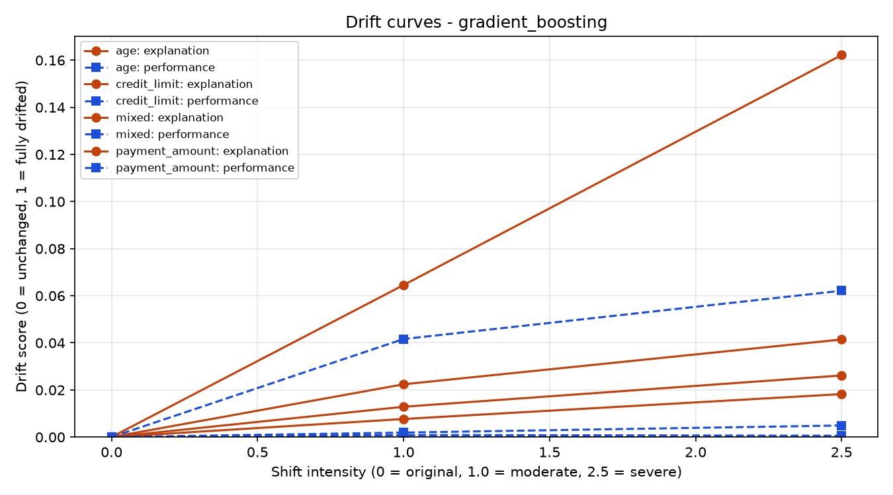
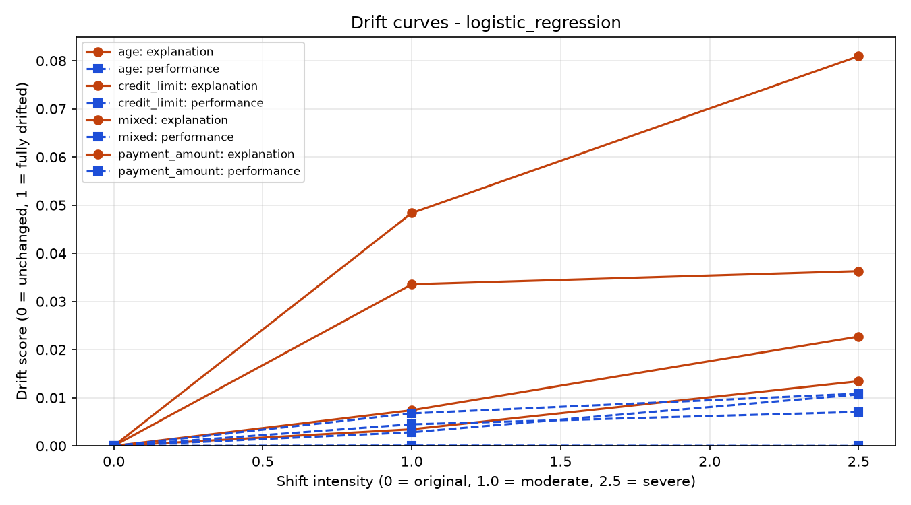
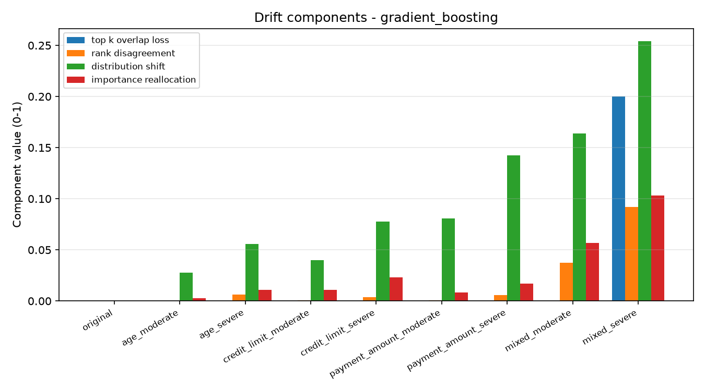
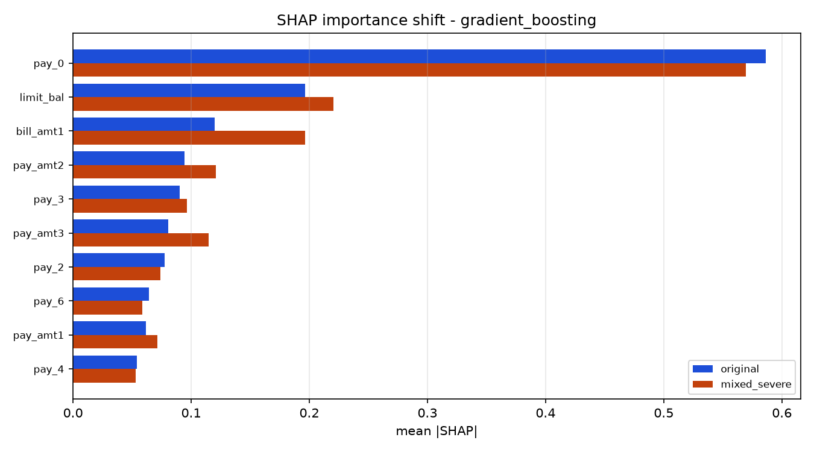

# Task 4: Explanation Drift Under Data Distribution Shift

**Research question:** when the input distribution moves under a frozen model, do
the model's *explanations* degrade before its *predictive performance* does?

This matters for production monitoring. AUC is a lagging signal. Computing it requires ground-truth labels, which in credit default arrive months later. SHAP explanations need no labels: the model and the incoming features are enough. If explanation drift rises earlier than performance loss, it can serve as a label-free early warning.

## Key finding

**In 16 of 16 shifted comparisons (2 models x 8 shifted datasets), explanation
drift exceeded performance drift.** The clearest case is `credit_limit_severe`,
where logistic regression *gained* accuracy (0.680 -> 0.726) and lost no AUC at all (0.7081 -> 0.7078) while its explanation drift score rose to 0.023 the model kept predicting just as well, for measurably different reasons.

A second, practical finding: of the four drift components, **SHAP distribution change reacts first and top-k overlap reacts last**. Gradient boosting's top-10 feature set does not change at all until the most extreme scenario, while its SHAP distribution distance has already tripled. Monitoring only "are the top features still the same?" The most common approach is the least sensitive choice available.

## Dataset and models

- **Dataset:** Taiwan Credit Card Default: [UCI ML Repository (id=350)](https://archive.ics.uci.edu/dataset/350/default+of+credit+card+clients), loaded via OpenML (`data_id=42477`), 30,000 clients, 23 features.
- **Split:** 80/20 stratified, `random_state=42` — identical to Tasks 1-3.
- **Baseline:** Logistic Regression (`class_weight="balanced"`, scaled features) -> SHAP via `LinearExplainer`.
- **Advanced:** Gradient Boosting (balanced `sample_weight`, raw features) -> SHAP via `TreeExplainer`.

Both models are trained **once** on the original training split and never refitted. The `StandardScaler` is fitted on the training split and frozen, as it would be in production.

## Method

### 1. Shift generation (`shift.py`)

Four interpretable shift families, each parameterised by one `intensity` multiplier so that "moderate" (1.0) and "severe" (2.5) are the *same* transformation at two strengths:

| Family           | Transformation                                                         |
| ---------------- | ---------------------------------------------------------------------- |
| `age`            | Population ages by `intensity x 5` years (additive, clipped to 18-100) |
| `credit_limit`   | Limits inflate by `1.35 ** intensity` (multiplicative)                 |
| `payment_amount` | Repayments shrink by `0.65 ** intensity`                               |
| `mixed`          | All three, plus Gaussian noise at 10% of each continuous feature's std |

Labels are held fixed: this is pure covariate shift. Categorical and ordinal columns are never perturbed.

### 2. Shift magnitude (`shift.py`)

"Moderate" and "severe" are not asserted, they are measured with Population Stability Index (quantile-binned, scale-free) and Wasserstein distance normalised by the reference standard deviation.

### 3. SHAP generation (`explain.py`)

Three rules make the comparison valid:

1. **Exact explainers only.** No sampling, so measured drift is real drift and not Monte Carlo noise.
2. **Frozen background.** The reference distribution is always the original training data, never the shifted frame being explained.
3. **Same rows everywhere.** Row indices are drawn once and reused across all nine datasets.

### 4. Drift metrics (`drift.py`)

Four bounded components, each oriented so that higher = more drift, combined
into one 0-1 `explanation_drift_score`:

| Component                 | Question                                    | Method                                |
| ------------------------- | ------------------------------------------- | ------------------------------------- |
| `top_k_overlap_loss`      | Are the top-k features still the same?      | `1 - |intersection|/k`                |
| `rank_disagreement`       | Is the full ranking preserved?              | `(1 - Spearman)/2`                    |
| `distribution_shift`      | Did the contributions' distribution change? | Mean Jensen-Shannon distance          |
| `importance_reallocation` | Did importance change hands?                | `L1/2` between normalised importances |

The performance side produces `performance_drift_score` on the same 0-1 scale (mean relative loss of ROC-AUC, PR-AUC and balanced accuracy, clipped at 0), so the two curves can be plotted on one axis.

## Results

All tables and figures below are generated by a single command and committed
under `[results/](results/)`.

### Shift magnitude — `[results/shift_magnitude.csv](results/shift_magnitude.csv)`

| dataset                 | mean PSI | max PSI | features with major shift | label    |
| ----------------------- | -------- | ------- | ------------------------- | -------- |
| age_moderate            | 0.028    | 0.640   | 1 / 23                    | major    |
| age_severe              | 0.148    | 3.401   | 1 / 23                    | major    |
| credit_limit_moderate   | 0.005    | 0.109   | 0 / 23                    | moderate |
| credit_limit_severe     | 0.028    | 0.644   | 1 / 23                    | major    |
| payment_amount_moderate | 0.036    | 0.163   | 0 / 23                    | moderate |
| payment_amount_severe   | 0.161    | 0.834   | 6 / 23                    | major    |
| mixed_moderate          | 0.191    | 0.761   | 6 / 23                    | major    |
| mixed_severe            | 0.444    | 2.681   | 12 / 23                   | major    |

PSI convention: `< 0.1` stable, `0.1-0.25` moderate, `> 0.25` major.

### Model performance — `[results/performance.csv](results/performance.csv)`

| model               | dataset             | accuracy | balanced acc. | ROC-AUC | PR-AUC | Brier  |
| ------------------- | ------------------- | -------- | ------------- | ------- | ------ | ------ |
| Logistic Regression | original            | 0.6797   | 0.6584        | 0.7081  | 0.4904 | 0.2089 |
| Logistic Regression | credit_limit_severe | 0.7260   | 0.6676        | 0.7078  | 0.4845 | 0.1934 |
| Logistic Regression | mixed_moderate      | 0.6675   | 0.6506        | 0.7058  | 0.4879 | 0.2111 |
| Logistic Regression | mixed_severe        | 0.6787   | 0.6531        | 0.7031  | 0.4819 | 0.2070 |
| Gradient Boosting   | original            | 0.7648   | 0.7120        | 0.7792  | 0.5541 | 0.1812 |
| Gradient Boosting   | credit_limit_severe | 0.7750   | 0.7109        | 0.7798  | 0.5551 | 0.1697 |
| Gradient Boosting   | mixed_moderate      | 0.7818   | 0.6884        | 0.7564  | 0.5188 | 0.1752 |
| Gradient Boosting   | mixed_severe        | 0.7813   | 0.6710        | 0.7417  | 0.5094 | 0.1727 |

Full 18-row table in the CSV. Note that raw accuracy is a poor guide here: under `mixed_severe` gradient boosting's accuracy *rises* to 0.7813 while its balanced accuracy falls from 0.7120 to 0.6710 The shift pushes predictions toward the majority class.

### Explanation drift — `[results/explanation_drift.csv](results/explanation_drift.csv)`

| dataset               | model | top-k loss | rank disagr. | distribution | reallocation | **score** |
| --------------------- | ----- | ---------- | ------------ | ------------ | ------------ | --------- |
| age_severe            | LR    | 0.0        | 0.005        | 0.024        | 0.025        | **0.013** |
| credit_limit_severe   | LR    | 0.0        | 0.000        | 0.016        | 0.074        | **0.023** |
| payment_amount_severe | LR    | 0.1        | 0.001        | 0.032        | 0.011        | **0.036** |
| mixed_moderate        | LR    | 0.1        | 0.005        | 0.066        | 0.022        | **0.048** |
| mixed_severe          | LR    | 0.1        | 0.010        | 0.120        | 0.093        | **0.081** |
| age_severe            | GB    | 0.0        | 0.006        | 0.055        | 0.011        | **0.018** |
| credit_limit_severe   | GB    | 0.0        | 0.002        | 0.077        | 0.023        | **0.026** |
| payment_amount_severe | GB    | 0.0        | 0.006        | 0.142        | 0.017        | **0.041** |
| mixed_moderate        | GB    | 0.0        | 0.038        | 0.165        | 0.057        | **0.065** |
| mixed_severe          | GB    | 0.2        | 0.092        | 0.254        | 0.103        | **0.162** |

The `distribution` column is consistently the largest contributor and the first to move; `top-k loss` is flat until the extreme.

### Early warning comparison — `[results/early_warning.csv](results/early_warning.csv)`

| dataset                 | model | explanation drift | performance drift | gap    | ratio |
| ----------------------- | ----- | ----------------- | ----------------- | ------ | ----- |
| age_moderate            | LR    | 0.003             | 0.003             | +0.001 | 1.2x  |
| age_severe              | LR    | 0.013             | 0.011             | +0.003 | 1.3x  |
| credit_limit_moderate   | LR    | 0.007             | 0.000             | +0.007 | 110x  |
| credit_limit_severe     | LR    | 0.023             | 0.000             | +0.023 | inf   |
| payment_amount_moderate | LR    | 0.034             | 0.004             | +0.029 | 7.5x  |
| payment_amount_severe   | LR    | 0.036             | 0.007             | +0.029 | 5.1x  |
| mixed_moderate          | LR    | 0.048             | 0.007             | +0.042 | 7.2x  |
| mixed_severe            | LR    | 0.081             | 0.011             | +0.070 | 7.5x  |
| age_moderate            | GB    | 0.008             | 0.001             | +0.007 | 8.8x  |
| age_severe              | GB    | 0.018             | 0.001             | +0.018 | 35x   |
| credit_limit_moderate   | GB    | 0.013             | 0.001             | +0.012 | 17x   |
| credit_limit_severe     | GB    | 0.026             | 0.000             | +0.026 | inf   |
| payment_amount_moderate | GB    | 0.022             | 0.002             | +0.020 | 11x   |
| payment_amount_severe   | GB    | 0.041             | 0.005             | +0.036 | 8.4x  |
| mixed_moderate          | GB    | 0.065             | 0.042             | +0.023 | 1.5x  |
| mixed_severe            | GB    | 0.162             | 0.062             | +0.100 | 2.6x  |

**Every gap is positive: 16/16.** Two summary statistics are reported because they answer different questions a sign test (`early_warning_rate` = 100%) and a majority verdict based on an absolute 0.05 tolerance (`degrade together`,  
crossing to `explanation degrades first` only at `mixed_severe`). The absolute threshold is deliberately conservative and is an arbitrary choice; the sign rate and the ratio column are the more defensible evidence.

### Figures

Explanation drift (solid) vs performance drift (dashed) along the shift intensity axis:

Which component carries the drift:

Global SHAP importance before and after the headline shift:

Per-model importance tables:
`[importance_logistic_regression.csv](results/importance_logistic_regression.csv)` ·
`[importance_gradient_boosting.csv](results/importance_gradient_boosting.csv)`

Auto-generated summary: `[results/benchmark_report.md](results/benchmark_report.md)`

## Conclusion

For this dataset and these two models, explanation stability degrades **before** predictive performance does without exception across 16 shifted comparisons. Where performance loses nothing at all (`credit_limit_severe`), the explanation still moves measurably, which is the cleanest possible demonstration of the claim: the model is right for different reasons than it used to be.

Gradient boosting is both the better predictor (AUC 0.779 vs 0.708) and the more fragile explainer (drift 0.162 vs 0.081 under `mixed_severe`). This extends the Task 3 finding that predictive performance and explanation reliability move in opposite directions from the static to the drifting case.

**Practical implication:** SHAP distribution distance is a usable label-free early-warning signal, and it is far more sensitive than top-k feature overlap. A monitoring setup that only checks whether the top features changed will react last.

## Limitations

1. **Synthetic shift.** Shifts are generated by controlled perturbation, not observed in production data. Labels are held fixed (pure covariate shift), which real drift rarely respects.
2. **One dataset, two models.** Findings are not claimed to generalise; the pipeline is built to be re-run elsewhere.
3. **Global importance only.** Drift is measured on `mean |SHAP|` across the population. Per-customer explanation stability is not measured here (Task 2 covers that axis).
4. **Arbitrary verdict threshold.** The 0.05 tolerance is a judgment call; the sign rate and drift ratio are reported alongside it for that reason.
5. **Exact explainers only.** Results may differ with sampling-based explainers such as `KernelExplainer` or LIME.

## Project layout

└── Task4/  
    ├── [README.md](http://README.md)  
    ├── explanation_drift/  
    ├── tests/  
    ├── results/  
    ├── requirements.txt  
    └── pytest.ini