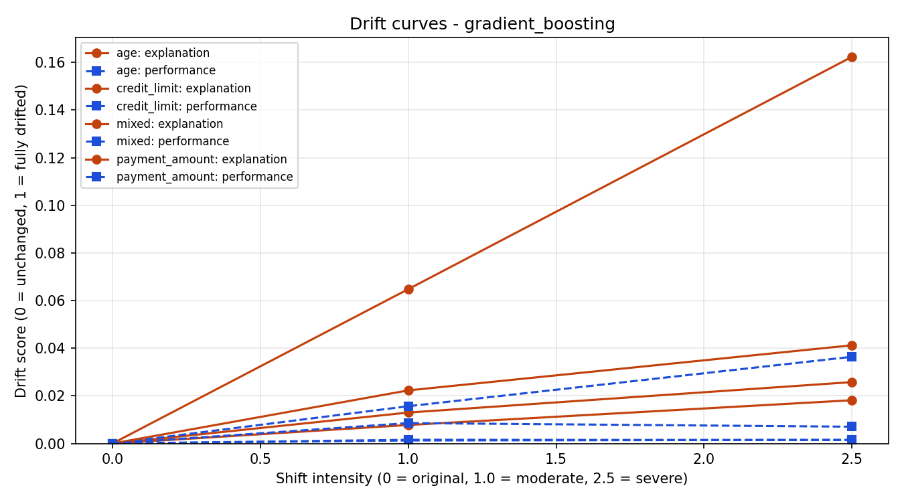
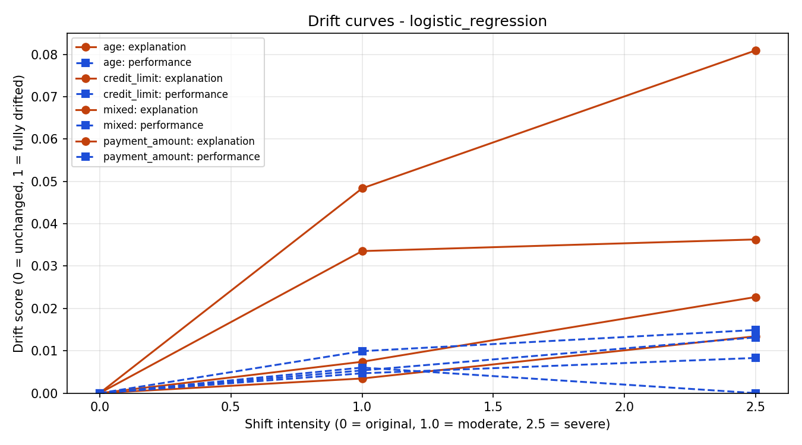
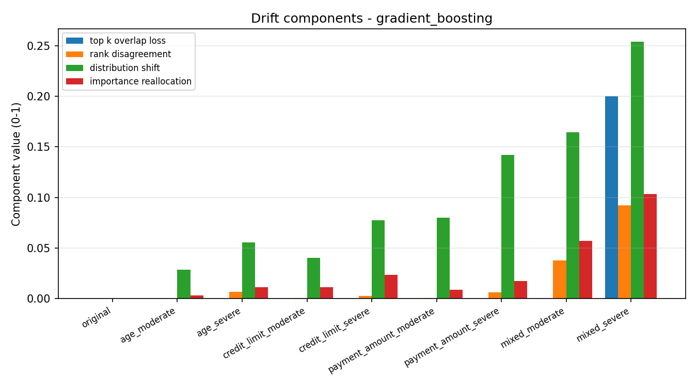
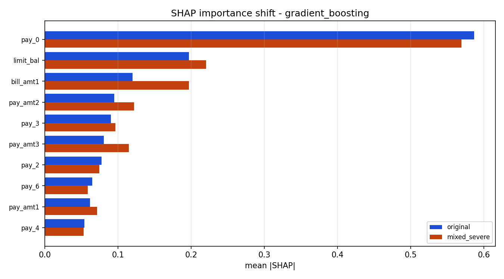

# Task 4: Explanation Drift Under Data Distribution Shift

**Research question:** when the input distribution moves under a frozen model, do
the model's *explanations* degrade before its *predictive performance* does?

This matters for production monitoring. AUC is a lagging signal, because
computing it needs ground-truth labels, and in credit default those arrive
months later. SHAP explanations need no labels: the model and the incoming
features are enough. If explanation drift becomes detectable earlier than
performance loss, it can serve as a label-free early warning.

## Key finding

Across 16 shifted scenarios (2 models x 8 shifted data sets):

| | count |
|---|---|
| Explanation drift crossed its own noise threshold | **5 / 16** |
| Performance drift crossed its own noise threshold | **0 / 16** |
| Explanation drift was the larger of the two scores | 15 / 16 |
| Gap interval stayed fully above zero | 12 / 16 |

The explanation signal became detectable in five scenarios. The performance
signal never did, and the reverse case never happened. The reason is visible in
the thresholds themselves: the performance score has a noise floor two to three
times higher than the explanation score at this sample size, so it needs a much
larger real change before it can be separated from sampling noise.

A second, practical finding: of the four drift components, **SHAP distribution
change reacts first and top-k overlap reacts last**. Gradient boosting's top-10
feature set does not change at all until the most extreme scenario, while its
SHAP distribution distance has already grown nine-fold. Monitoring only "are the
top features still the same?" is the least sensitive choice available.

The relation is not guaranteed in either direction. In one scenario
(`age_moderate`, logistic regression) the gap is slightly negative, and the
repository carries a test that constructs a case where a *larger* shift produces
a *lower* drift score. Monotonicity is measured and reported here, never assumed.

## Dataset and models

- **Dataset:** Taiwan Credit Card Default, [UCI ML Repository (id=350)](https://archive.ics.uci.edu/dataset/350/default+of+credit+card+clients), loaded from OpenML (`data_id=42477`), 30,000 clients, 23 features.
- **Split:** 80/20 stratified, `random_state=42`, the same split as Tasks 1-3.
- **Baseline:** Logistic Regression (`class_weight="balanced"`, scaled features), SHAP via `LinearExplainer`.
- **Advanced:** Gradient Boosting (balanced `sample_weight`, raw features), SHAP via `TreeExplainer`.

Both models are trained once on the original training split and never refitted.
The `StandardScaler` is fitted on the training split and then frozen, the way a
production pipeline behaves when the input distribution moves.

## Method

### 1. Shift generation (`shift.py`)

Four shift families, each controlled by one `intensity` multiplier, so that
"moderate" (1.0) and "severe" (2.5) are the same transformation at two
strengths:

| Family | Transformation |
|---|---|
| `age` | The population ages by `intensity x 5` years (additive, clipped to 18-100) |
| `credit_limit` | Limits grow by `1.35 ** intensity` (multiplicative) |
| `payment_amount` | Repayments shrink by `0.65 ** intensity` |
| `mixed` | All three, plus Gaussian noise at 10% of each continuous feature's std |

Labels are held fixed, so this is pure covariate shift. Categorical and ordinal
columns are never perturbed.

### 2. Shift magnitude (`shift.py`)

"Moderate" and "severe" are measured, not asserted: Population Stability Index
(quantile-binned, so it is scale-free) and Wasserstein distance normalised by the
reference standard deviation.

### 3. SHAP generation (`explain.py`)

Three rules keep the comparison valid:

1. **Exact explainers only.** No sampling, so measured drift is real drift and not Monte Carlo noise.
2. **Frozen background.** The reference distribution is always the original training data, never the shifted frame being explained.
3. **Same rows everywhere.** Row indices are drawn once and reused across all nine data sets.

### 4. Drift metrics (`drift.py`)

Four bounded components, all oriented so that higher means more drift, combined
into one 0-1 `explanation_drift_score`:

| Component | Question | Method |
|---|---|---|
| `top_k_overlap_loss` | Are the top-k features still the same? | `1 - \|intersection\|/k` |
| `rank_disagreement` | Is the full ranking kept? | `(1 - Spearman)/2` |
| `distribution_shift` | Did the shape of the contributions change? | Mean Jensen-Shannon distance |
| `importance_reallocation` | Did importance move between features? | `L1/2` between normalised importances |

The performance side produces `performance_drift_score` on the same 0-1 scale
(mean relative loss of ROC-AUC, PR-AUC and balanced accuracy, clipped at 0), so
the two curves share one axis.

### 5. Early warning thresholds (`thresholds.py`)

A drift score is never exactly zero, even with no shift at all, because the test
set is a finite sample. One fixed number cannot serve both scores: they do not
have the same amount of noise.

Each score therefore gets its own threshold, estimated from the unshifted data:

1. Draw two independent bootstrap resamples of the customers in the unshifted test set.
2. Measure both drift scores between those two resamples.
3. Repeat 200 times. This is the null distribution: what the scores do when only the sample changes.
4. The threshold is the 95th percentile of that distribution.

A value above the threshold is unlikely (5 percent at this quantile) to be
sampling noise alone. The same resampling gives a 95 percent percentile interval
for the gap between the two scores, which answers whether the explanation really
moved more than the performance.

SHAP is computed once and the resampling is applied to the rows of that matrix,
which is equivalent to resampling customers and avoids recomputing SHAP 400
times.

Both scores in the comparison are measured on the rows that were explained, so
they share the same sample size and the same noise level.

## Results

Every table and figure below is produced by one command and committed under
[`results/`](results/).

### Early warning thresholds - [`results/thresholds.csv`](results/thresholds.csv)

| model | explanation threshold | performance threshold | quantile | resamples |
|---|---|---|---|---|
| Logistic Regression | 0.0489 | 0.0854 | 0.95 | 200 |
| Gradient Boosting | 0.0251 | 0.0715 | 0.95 | 200 |

The performance threshold is the higher one for both models. That is the core
reason performance is the later signal here.

### Early warning comparison - [`results/early_warning.csv`](results/early_warning.csv)

| dataset | model | explanation drift | performance drift | gap 95% interval | verdict |
|---|---|---|---|---|---|
| age_moderate | LR | 0.0035 | 0.0054 | [-0.007, +0.004] | no drift detected |
| age_severe | LR | 0.0134 | 0.0132 | [-0.010, +0.012] | no drift detected |
| credit_limit_moderate | LR | 0.0074 | 0.0060 | [-0.007, +0.008] | no drift detected |
| credit_limit_severe | LR | 0.0227 | 0.0000 | [+0.006, +0.024] | no drift detected |
| payment_amount_moderate | LR | 0.0335 | 0.0047 | [+0.002, +0.035] | no drift detected |
| payment_amount_severe | LR | 0.0363 | 0.0083 | [-0.002, +0.039] | no drift detected |
| mixed_moderate | LR | 0.0484 | 0.0099 | [+0.009, +0.048] | no drift detected |
| **mixed_severe** | LR | 0.0809 | 0.0149 | [+0.033, +0.083] | **explanation drift only** |
| age_moderate | GB | 0.0078 | 0.0016 | [+0.003, +0.010] | no drift detected |
| age_severe | GB | 0.0182 | 0.0015 | [+0.010, +0.021] | no drift detected |
| credit_limit_moderate | GB | 0.0130 | 0.0013 | [+0.006, +0.016] | no drift detected |
| **credit_limit_severe** | GB | 0.0258 | 0.0015 | [+0.012, +0.030] | **explanation drift only** |
| payment_amount_moderate | GB | 0.0223 | 0.0086 | [+0.009, +0.024] | no drift detected |
| **payment_amount_severe** | GB | 0.0412 | 0.0071 | [+0.026, +0.069] | **explanation drift only** |
| **mixed_moderate** | GB | 0.0648 | 0.0157 | [+0.024, +0.093] | **explanation drift only** |
| **mixed_severe** | GB | 0.1624 | 0.0364 | [+0.072, +0.166] | **explanation drift only** |

`mixed_moderate` for logistic regression lands at 0.0484 against a threshold of
0.0489. It is reported as not detected; moving a threshold to capture a result
would defeat the purpose of estimating it.

### Shift magnitude - [`results/shift_magnitude.csv`](results/shift_magnitude.csv)

| dataset | mean PSI | max PSI | features with major shift |
|---|---|---|---|
| age_moderate | 0.028 | 0.640 | 1 / 23 |
| age_severe | 0.148 | 3.401 | 1 / 23 |
| credit_limit_moderate | 0.005 | 0.109 | 0 / 23 |
| credit_limit_severe | 0.028 | 0.644 | 1 / 23 |
| payment_amount_moderate | 0.036 | 0.163 | 0 / 23 |
| payment_amount_severe | 0.161 | 0.834 | 6 / 23 |
| mixed_moderate | 0.191 | 0.761 | 6 / 23 |
| mixed_severe | 0.444 | 2.681 | 12 / 23 |

PSI convention: below 0.1 stable, 0.1 to 0.25 moderate, above 0.25 major.

### Model performance - [`results/performance.csv`](results/performance.csv)

| model | dataset | accuracy | balanced acc. | ROC-AUC | PR-AUC | Brier |
|---|---|---|---|---|---|---|
| Logistic Regression | original | 0.6797 | 0.6584 | 0.7081 | 0.4904 | 0.2089 |
| Logistic Regression | credit_limit_severe | 0.7260 | 0.6676 | 0.7078 | 0.4845 | 0.1934 |
| Logistic Regression | mixed_severe | 0.6787 | 0.6531 | 0.7031 | 0.4819 | 0.2070 |
| Gradient Boosting | original | 0.7648 | 0.7120 | 0.7792 | 0.5541 | 0.1812 |
| Gradient Boosting | credit_limit_severe | 0.7750 | 0.7109 | 0.7798 | 0.5551 | 0.1697 |
| Gradient Boosting | mixed_severe | 0.7813 | 0.6710 | 0.7417 | 0.5094 | 0.1727 |

The full 18-row table is in the CSV. Raw accuracy is a poor guide here: under
`mixed_severe` gradient boosting's accuracy *rises* to 0.7813 while its balanced
accuracy falls from 0.7120 to 0.6710, because the shift pushes predictions toward
the majority class.

### Explanation drift components - [`results/explanation_drift.csv`](results/explanation_drift.csv)

| dataset | model | top-k loss | rank disagr. | distribution | reallocation | score |
|---|---|---|---|---|---|---|
| credit_limit_severe | LR | 0.0 | 0.000 | 0.016 | 0.074 | 0.023 |
| mixed_moderate | LR | 0.1 | 0.005 | 0.066 | 0.022 | 0.048 |
| mixed_severe | LR | 0.1 | 0.010 | 0.120 | 0.093 | 0.081 |
| credit_limit_severe | GB | 0.0 | 0.002 | 0.077 | 0.023 | 0.026 |
| payment_amount_severe | GB | 0.0 | 0.006 | 0.142 | 0.017 | 0.041 |
| mixed_moderate | GB | 0.0 | 0.038 | 0.165 | 0.057 | 0.065 |
| mixed_severe | GB | 0.2 | 0.092 | 0.254 | 0.103 | 0.162 |

`distribution` is consistently the largest contributor and the first to move;
`top-k loss` stays flat until the extreme.

### Figures

Explanation drift (solid) against performance drift (dashed) along the shift
intensity axis:




Which component carries the drift:



Global SHAP importance before and after the headline shift:



Per-model importance tables:
[`importance_logistic_regression.csv`](results/importance_logistic_regression.csv) and
[`importance_gradient_boosting.csv`](results/importance_gradient_boosting.csv).

Auto-generated summary: [`results/benchmark_report.md`](results/benchmark_report.md).

## Conclusion

For this dataset and these two models, explanation drift becomes detectable
before performance loss does. It crossed its own noise threshold in 5 of 16
scenarios; performance drift crossed its own in none of them, and the reverse
ordering never occurred. The gap between the two scores is positive in 15 of 16
scenarios and its 95 percent interval excludes zero in 12 of them.

The mechanism is the noise floor. At 1,000 monitored customers the performance
score needs to lose about 7 to 9 percent of its reference value before that loss
can be told apart from resampling, while the explanation score needs only 2.5 to
5 percent. A label-free signal that is also less noisy is a better monitor.

Gradient boosting is both the better predictor (AUC 0.779 against 0.708) and the
more fragile explainer (drift 0.162 against 0.081 under `mixed_severe`). This
extends the Task 3 finding, that predictive performance and explanation
reliability move in opposite directions, from the static to the drifting case.

**Practical implication:** SHAP distribution distance is a usable label-free
early-warning signal, and it is far more sensitive than top-k feature overlap. A
monitoring setup that only checks whether the top features changed reacts last.

## Limitations

1. **Synthetic shift.** Shifts are generated by controlled perturbation, not observed in production data. Labels are held fixed (pure covariate shift), which real drift rarely respects.
2. **One dataset, two models.** Nothing here is claimed to generalise; the pipeline is built to be re-run elsewhere.
3. **Thresholds depend on the monitoring window.** They are estimated at 1,000 explained rows. A larger window lowers both noise floors. The method transfers, the numbers do not.
4. **Most scenarios are below both thresholds.** 11 of 16 shifted scenarios are reported as not detected. The single-feature shifts are simply too small to separate from noise at this sample size, and that is reported rather than hidden.
5. **Global importance only.** Drift is measured on mean absolute SHAP across the population. Per-customer explanation stability is a different axis, covered by Task 2.
6. **Exact explainers only.** Results may differ with sampling-based explainers such as `KernelExplainer` or LIME.

## Project layout

```
Task4/
|-- explanation_drift/
|   |-- data.py         # loading, validation, split, frozen scaler
|   |-- models.py       # baseline and advanced training, persistence
|   |-- metrics.py      # predictive performance and performance drift score
|   |-- shift.py        # shift generation, PSI and Wasserstein magnitude
|   |-- explain.py      # exact SHAP, frozen background, aggregation
|   |-- drift.py        # explanation drift metrics
|   |-- thresholds.py   # bootstrap null distribution and thresholds
|   |-- report.py       # tables, figures, markdown
|   `-- pipeline.py     # end-to-end runner and CLI
|-- tests/              # 239 pytest tests
|-- results/            # committed reference run, linked from this README
|-- outputs/            # local scratch runs (git-ignored)
|-- requirements.txt
`-- pytest.ini
```

## Setup and reproduction

```bash
cd ..
python3 -m venv .venv
source .venv/bin/activate
pip install -r Task4/requirements.txt

cd Task4
python -m explanation_drift.pipeline --max-samples 1000 --bootstrap-samples 200 --output-dir results
```

The run is deterministic (`seed=42`) and takes about one minute. Options:
`--local-path` (use the raw UCI `.xls` instead of OpenML), `--max-samples` (rows
to explain, omit for all 6,000), `--top-k`, `--bootstrap-samples`, `--seed`.

## Tests

```bash
cd Task4
pytest
```

Coverage is measured on every run and the run fails below 80 percent. The stored
output is [`results/coverage.txt`](results/coverage.txt):

```
Name                              Stmts   Miss Branch BrPart  Cover   Missing
-----------------------------------------------------------------------------
explanation_drift/data.py            97      0     34      0   100%
explanation_drift/drift.py          123      0     46      0   100%
explanation_drift/explain.py        111      0     42      0   100%
explanation_drift/metrics.py         61      0     32      0   100%
explanation_drift/models.py          75      0     18      0   100%
explanation_drift/pipeline.py       115      0     22      1    99%   251->238
explanation_drift/report.py         130      0     34      1    99%   199->201
explanation_drift/shift.py          147      0     52      0   100%
explanation_drift/thresholds.py     104      0     30      0   100%
-----------------------------------------------------------------------------
TOTAL                               964      0    310      2    99%
Required test coverage of 80% reached. Total coverage: 99.84%
239 passed
```

Every statement in the evaluation package is covered. The two partial branches
are loop exits that never trigger. No test touches the network or the 30k-row
file: they all run against small synthetic frames with the same schema as the
real dataset.

| Test module | Tests | Focus |
|---|---|---|
| `test_data.py` | 28 | Loading, validation, split reproducibility, scaling |
| `test_models.py` | 19 | Training, prediction, determinism, persistence |
| `test_metrics.py` | 22 | Performance metrics, degradation sign conventions |
| `test_shift.py` | 58 | Shift families, invariants, PSI and Wasserstein correctness |
| `test_explain.py` | 29 | SHAP additivity, frozen background, aggregation, wiring |
| `test_drift.py` | 32 | Drift metrics against analytically known values, invariants |
| `test_thresholds.py` | 22 | Null distribution, thresholds, classification, gap interval |
| `test_report.py` | 13 | Figure content, table and markdown output |
| `test_pipeline.py` | 16 | End-to-end orchestration, artefacts, CLI |

### What the tests assert, and what they do not

Correctness is checked against values that are known in advance: SHAP additivity
(`sum(shap) + base == model margin`), `PSI(x, x) == 0`, the Wasserstein distance
of a one-sigma translation equal to 1.0, the Spearman correlation of a reversed
ranking equal to -1, and the symmetry and 0-1 bounds of the composite score.

The tests deliberately do **not** assert experimental outcomes. Earlier versions
required a severe shift to produce a higher drift score than a moderate one. That
is a result, not a correctness rule, and it is not guaranteed: for a linear model
a SHAP value is `weight * (x - background mean)`, so pushing a feature past that
mean can bring its attribution back to the original size and return global
importance to the reference. `test_larger_shift_can_lower_the_drift_score`
constructs exactly that case. Monotonicity is now measured in the benchmark and
reported as a result.

## Deliverables

| Requirement | Where |
|---|---|
| Training pipeline | `models.py`, `pipeline.py` |
| Shift generation module | `shift.py` |
| SHAP evaluation module | `explain.py` |
| Explanation drift metrics | `drift.py` |
| Early warning threshold selection | `thresholds.py`, `results/thresholds.csv` |
| Performance comparison tables | `results/performance.csv`, `results/early_warning.csv` |
| Final benchmark report | `results/benchmark_report.md` and this README |
| README | this file |
| Automated tests, at least 80% coverage | `tests/` - 239 tests, 99.84% branch coverage, enforced by `pytest.ini` |
